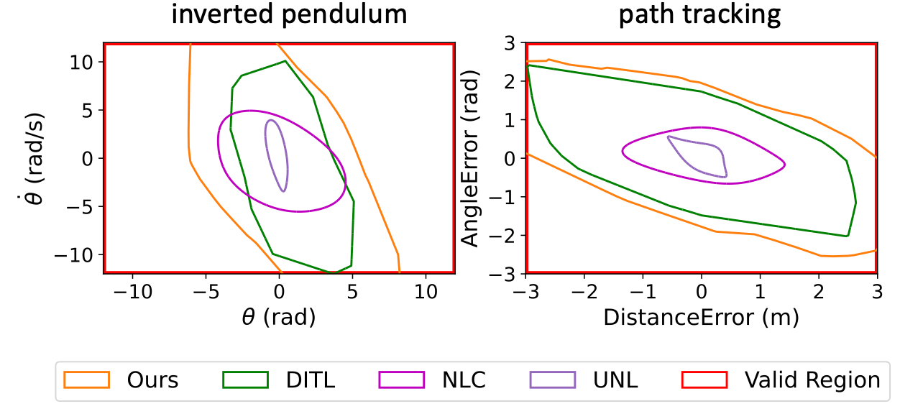
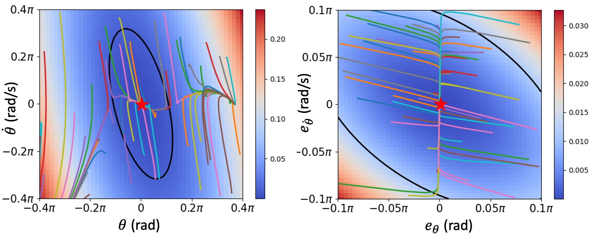
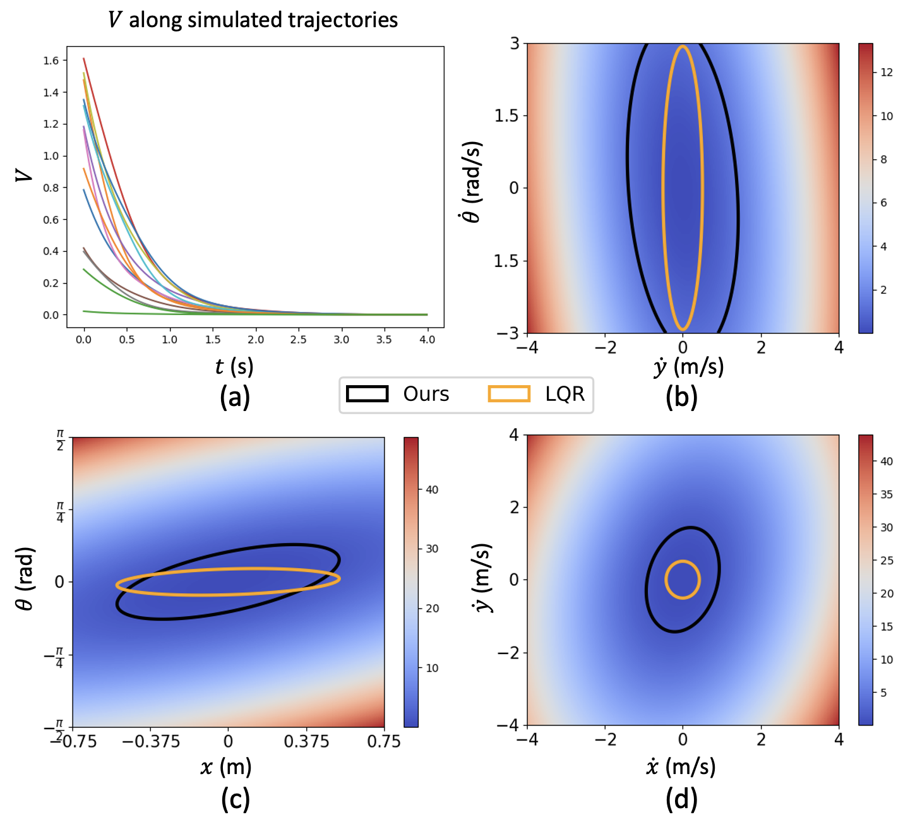
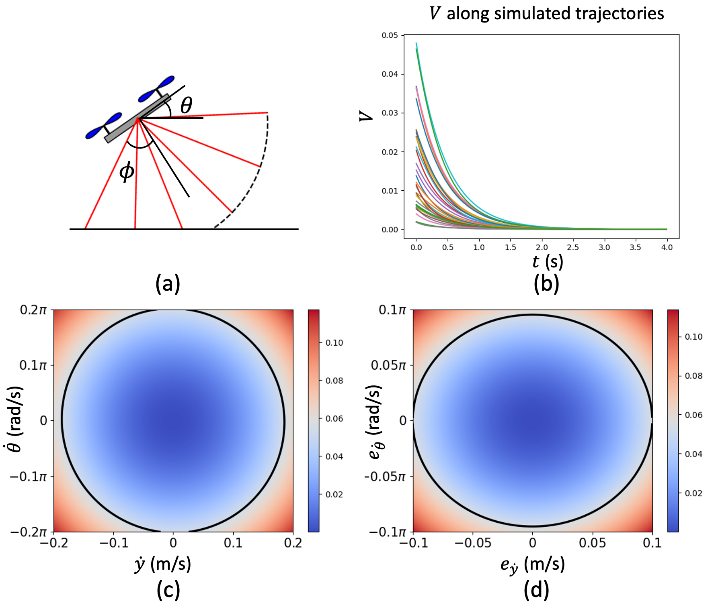

# Lyapunov-stable Neural Control for State and Output Feedback: A Novel Formulation

Our work studies neural network controllers and observers with provable Lyapunov stability guarantees. Due to the complexity of neural networks and nonlinear system dynamics, it is often challenging to obtain formal stability guarantees for learning-enabled systems. Our work tackles this challenge with a few key contributions:

* We propose a novel formulation for stability verification that **theoretically defines a larger verifiable region-of-attraction** (ROA) than shown in the literature.
* We propose a **new training framework** for learning neural network (NN) controllers/observers together with Lyapunov certificates using fast empirical falsification and strategic regularization.
* Our method **does not rely on expensive solvers** such as MIP, SMT, or SDP in both the training and verification stages.
* For the first time in literature, we synthesize and formally verify **neural-network controllers and observers** (output-feedback) together with Lyapunov functions for **general nonlinear** dynamical systems and observation functions.

More details can be found in **our paper:**

*Lujie Yang\*, Hongkai Dai\*, Zhouxing Shi, Cho-Jui Hsieh, Russ Tedrake, and Huan Zhang*
"[Lyapunov-stable Neural Control for State and Output Feedback: A Novel Formulation](https://arxiv.org/pdf/2404.07956.pdf)" (\*Equal contribution)

## Examples

We evaluate our training and verification method on several state-feedback and output-feedback systems with nonlinear dynamics.

| Pendulum & Path tracking <br> state feedback <br> | Pendulum output feedback|
|:--:| :--:|
| | |

| Quadrotor state feedback| Quadrotor output feedback |
|:--:| :--:|
|  | |

# Code

## Installation

Create a conda environment and install the dependencies except those for verification:
```bash
conda create --name lnc python=3.11
conda activate lnc
pip install -r requirements.txt
```

We use [auto_LiRPA](https://github.com/Verified-Intelligence/auto_LiRPA.git) and [alpha-beta-CROWN](https://github.com/Verified-Intelligence/alpha-beta-CROWN.git) for verification. To install both of them, run:
```bash
git clone --recursive https://github.com/Verified-Intelligence/alpha-beta-CROWN.git
(cd alpha-beta-CROWN/auto_LiRPA && pip install -e .)
(cd alpha-beta-CROWN/complete_verifier && pip install -r requirements.txt)
```

To set up the path:
```
export PYTHONPATH="${PYTHONPATH}:$(pwd):$(pwd)/alpha-beta-CROWN:$(pwd)/alpha-beta-CROWN/complete_verifier"
```

## Verification

We have provided the models we trained and the specifications for verification we generated.
To run verification with our **pre-trained models** and specifications:

```bash
cd verification
export CONFIG_PATH=$(pwd)
cd complete_verifier

# Run the following for each of the systems
python abcrown.py --config $CONFIG_PATH/path_tracking_state_feedback_lyapunov_in_levelset.yaml
python abcrown.py --config $CONFIG_PATH/pendulum_state_feedback_lyapunov_in_levelset.yaml
python abcrown.py --config $CONFIG_PATH/pendulum_output_feedback_lyapunov_in_levelset.yaml
python abcrown.py --config $CONFIG_PATH/quadrotor2d_state_feedback_lyapunov_in_levelset.yaml
python abcrown.py --config $CONFIG_PATH/quadrotor2d_output_feedback_lyapunov_in_levelset.yaml
```

The verification will output a summary of results. For example, here are the
results we obtained on Pendulum Output Feedback using `pendulum_output_feedback_lyapunov_in_levelset.yaml`:
```
############# Summary #############
Final verified acc: 100.0% (total 8 examples)
Problem instances count: 8 , total verified (safe/unsat): 8 , total falsified (unsafe/sat): 0 , timeout: 0
mean time for ALL instances (total 8):12.023795893354652, max time: 23.111693859100342
mean time for verified SAFE instances(total 8): 12.023810923099518, max time: 23.111693859100342
safe (total 8), index: [0, 1, 2, 3, 4, 5, 6, 7]
```
It shows that the 8 examples (sub-regions for verification) are all verified
and no example is falsified or timeout. Therefore, the verification fully succeeded.

Our verification configurations have been tested on a GPU with 48GB memory.
If you are using a GPU with less memory, you may decrease the batch size
of verification by modifying the `batch_size` item in the configuration files
or passing an argument `--batch_size BATCH_SIZE`,
until it fits into the GPU memory.

## Training

```
python examples/pendulum_state_training.py
python examples/pendulum_output_training.py
python examples/path_tracking_state_training.py
python examples/quadrotor2d_state_training.py
python examples/quadrotor2d_output_training.py
```

All the training files provide an estimate of the sublevel set value $\hat \rho_{\text{max}}$, figures of ROA slices and $V(x_t)$ along simulated trajectories after the training ends.

We use `hydra` to manage all the configurations. Take pendulum state feedback training as an example, it loads the configuration file in `examples/config/pendulum_state_training.yaml` file for all the parameters. To set your specific parameters, we recommend adding the config file in examples/config/user/USERNAME.yaml, and then run the command
```
python examples/pendulum_state_training.py user=USERNAME
```
You can pattern match `examples/config/user/pendulum_state_training_default.yaml` file to set your own `USERNAME.yaml`.

To reproduce the pendulum state traning result in our paper, please use the following command with a non-default config file

```
python examples/pendulum_state_training.py --config-name pendulum_state_training_reproduce
```

Note that each run will create a directory, specified in `user.run_dir` in the configuration yaml file. The directory will contain the learned model, wandb data, and the configuration file `config.yaml` used for that run, so that you can easily reproduce the result with the saved configuration file.

You can change `cfg.model.limit_scale` to increase the region for training. We recommend starting from 0.1 and gradually grow the limit scale to 1.0, using models from smaller regions as initializations for larger regions. You can also change `cfg.model.rho_multiplier` to encourage the growth of the sublevel set.

Before the end of the training procedure, the program will first test the trained models using projected gradient descent (PGD). Usually, PGD won't be able to find any counterexamples at the end of training, so the models are ready for formal verification. In addition, `rho` used during training will be printed out, which can be used as the `--init_rho` for the bisection in the verification step.

```
[2024-04-11 00:42:36,757][__main__][INFO] - PGD verifier finds counter examples? False
rho =  0.12872669100761414
```

If PGD attacks can still find counterexamples after training, you should set `cfg.train.train_lyaloss = False` and decrease the last entry of `cfg.model.rho_multiplier` until PGD attack can no longer find counterexamples to obtain a more accurate $\hat \rho_{\text{max}}$.

## Preparing Specifications for Verification

This section is for the stability verification of new models (e.g., controllers, observers, and/or Lyapunov functions trained from scratch). If you use the pre-trained models described [above](#verification), these instructions are not needed since we already provided specifications in this repo.

Theorem 3.3 in our paper defines the condition for stability verification. The steps below first find the largest $\rho$ in Theorem 3.3 using a bisection script.

### Bisection for $\rho$

We can use bisection to find the largest $\rho$ that satisfies the verification objective.
We use the script `neural_lyapunov_training/bisect.py` for automatic bisection.

We need to specify the region for verification using `--lower_limit`, `--upper_limit`, and `--hole_size`.
The `--lower_limit` and `--upper_limit` define the region of interests $\mathcal{B}$ (which is problem specific; see Table 3 in the Appendix of our paper). The `--hole_size` excludes a very small region (default 0.1%) around the origin, which the verifier may have numerical issues with since the Lyapunov function values are very close to 0.

We provide an initial $\rho$ value by `--init_rho`
and specify the precision for the bisection by `--rho_eps`.
`--init_rho` is the initial guess of sublevel set value, and you can use the `rho` reported after training finishes (see training steps above).
For verification during the bisection, a configuration file needs to be specified
by `--config` and a timeout value is needed by `--timeout`.
Optionally, a `--output_folder` argument may be used to specify an output folder the bisection.
Additional arguments for the verifier may also be provided.

For models which may take a long time to verify, you may add `--check_x_adv_only`
to only check $\xi_{t+1}\in\mathcal{B}$ but not $-F(\xi_t)>0$
(Theorem 3.3 in our paper) during the bisection.
In case that the $\rho$ you obtain from the bisection does not lead to a
successful verification when you generate full specifications using the $\rho$
(see the next sections), you may further reduce $\rho$ manually.

```bash
cd verification
python -m neural_lyapunov_training.bisect \
--lower_limit -12 -12 --upper_limit 12 12 --hole_size 0.001 \
--init_rho 603.5202 --rho_eps 0.1 \
--config pendulum_state_feedback_lyapunov_in_levelset.yaml \
--timeout 100
```

The bisection will output the result of each bisection iteration. For example:
```txt
Generating specs with rho=603.5202
Start verification
Output path: ./output/rho_603.52020.txt
Result: defaultdict(<class 'list'>, {'safe': [0, 1, 2, 3]})
safe
```
In the end, it will output the lower bound and upper bound for $\rho$ as:
```txt
rho_l=708.0606252685546
rho_u=708.1342971679687
```
We can take the lower bound of $\rho$ denoted as `rho_l` above. Note that if you are _not_ using `--check_x_adv_only`, then the model is verified with the sublevel set value `rho_l`; in this case, the next step is not necessary, although it can still be helpful to save the specifications with this specific `rho_l` for reproducing the verification results without bisection.

### Specification generation with a specific $\rho$

After obtaining a suitable $\rho$ value,
we generate the specifications for verification with a fixed $\rho$.
We use VNNLIB format files to describe the specification.
The command below will generate several VNNLIB files and a CSV file with a list of
all VNNLIB filenames. Each VNNLIB file describes a subproblem to verify, and
the number of subproblems is determined by the state dimension.
Similar to the aforementioned bisection, `--lower_limit`, `--upper_limit`, and `--hole_size` need to be specified. And the sublevel set value $\rho$ is provided by `--value_levelset`.
All specification files will be saved in the `specs` folder.

```
cd verification
python -m neural_lyapunov_training.generate_vnnlib \
--lower_limit -12 -12 --upper_limit 12 12 --hole_size 0.001 \
--value_levelset 672 \
specs/pendulum_state_feedback
```

You can then run verification, as we mentioned in the "Verification" section.
